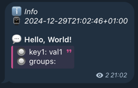

# Basic usage

## Code
```go
package main

import (
	"log/slog"

	slogtelegram "github.com/platx/slog-telegram"
)

func main() {
	handler := slogtelegram.DefaultHandler(
		"YOUR_BOT_TOKEN", // Bot token (https://t.me/botfather)
		1234567890,       // Chat ID (https://t.me/get_id_bot)
	)

	logger := slog.New(handler)

	logger.Debug("Hello, World!", slog.Any("key1", "val1")) // ignored by default
	logger.Info("Hello, World!", slog.Any("key1", "val1"))
}

```

## Output

