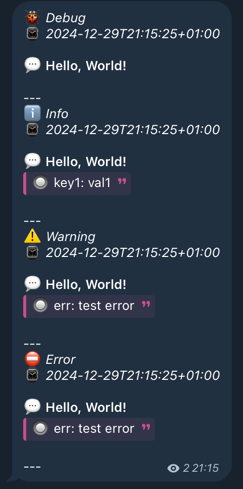

# Basic usage

## Code
```go
package main

import (
	"errors"
	"log/slog"
	"time"

	slogtelegram "github.com/platx/slog-telegram"
)

func main() {
	handler := slogtelegram.NewHandler(slogtelegram.HandlerOptions{
		Level: slog.LevelDebug,
		Sender: slogtelegram.SenderOptions{
			Token:         "YOUR_BOT_TOKEN", // Telegram bot token (https://t.me/botfather).
			ChatID:        1234567890,       // Chat ID to send messages to (https://t.me/get_id_bot).
			BatchSize:     10,               // Maximum number of messages to send in a single batch.
			FlushInterval: time.Minute,      // Maximum duration to wait before sending a batch.
		},
	})
	defer func() {
		if err := handler.Close(); err != nil {
			panic(err)
		}
	}()

	logger := slog.New(handler)

	logger.Debug("Hello, World!")
	logger.Info("Hello, World!", slog.Any("key1", "val1"))
	logger.Warn("Hello, World!", slog.Any("err", errors.New("test error")))
	logger.Error("Hello, World!", slog.Any("err", errors.New("test error")))
}

```

**⚠️ CAUTION:** please do not forget to close the handler to avoid data loss and goroutines leak.

## Output

