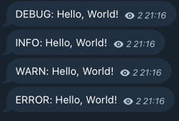

# Basic usage

## Code
```go
package main

import (
	"errors"
	"log/slog"

	slogtelegram "github.com/platx/slog-telegram"
)

func main() {
	handler := slogtelegram.NewHandler(slogtelegram.HandlerOptions{
		Level: slog.LevelDebug,
		Sender: slogtelegram.SenderOptions{
			Token:         "YOUR_BOT_TOKEN", // Telegram bot token (https://t.me/botfather).
			ChatID:        1234567890,       // Chat ID to send messages to (https://t.me/get_id_bot).
		},
		Formatter: slogtelegram.FormatterOptions{
			Template: "{{.Level}}: {{.Message}}",
			LevelFormatter: func(record slog.Record) string {
				return record.Level.String()
			},
			MessageFormatter: func(record slog.Record) string {
				return record.Message
			},
		},
	})

	logger := slog.New(handler)

	logger.Info("Hello, World!", slog.Any("key1", "val1"))
	logger.Warn("Hello, World!", slog.Any("err", errors.New("test error")))
	logger.Error("Hello, World!", slog.Any("err", errors.New("test error")))
}

```

## Output

